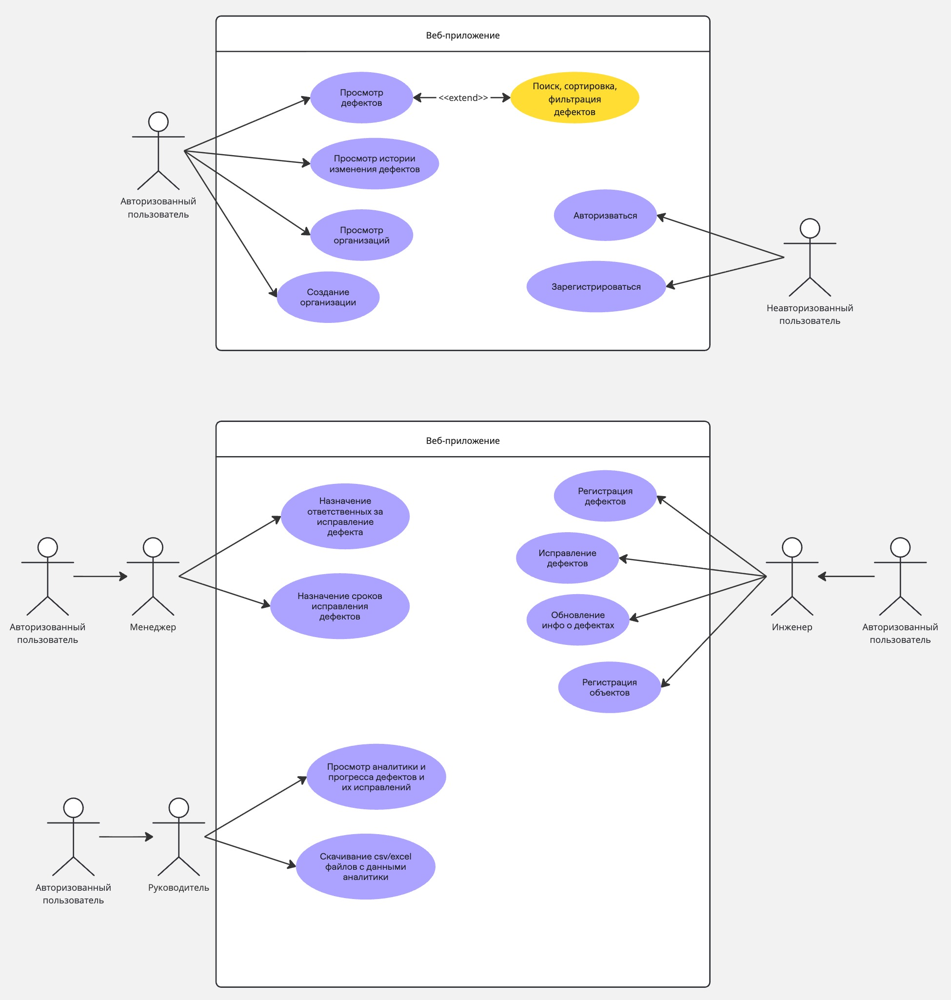
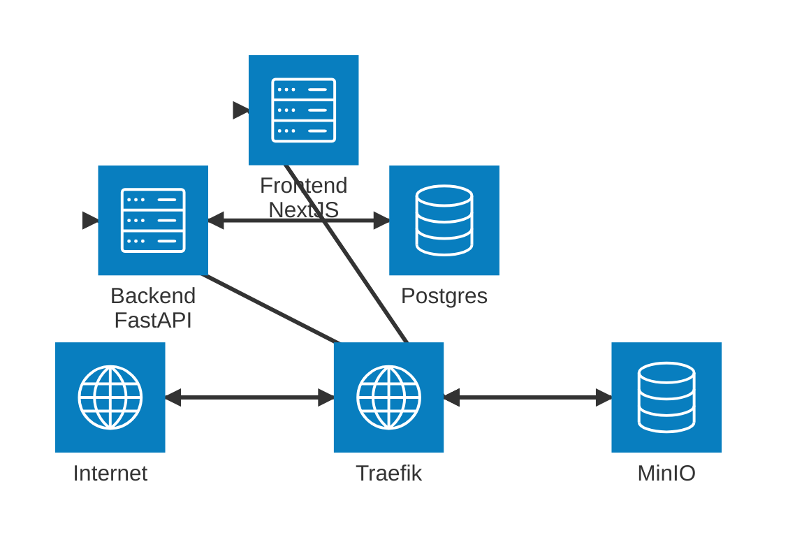
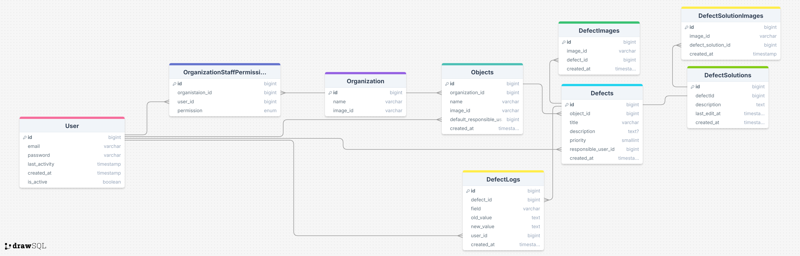

# Проект "Система Контроля" по работе со строительными компаниями
Является веб-приложением для централизованного управления дефектами на строительных объектах. Система обеспечивает полный цикл работы: от регистрации дефекта и назначения исполнителя до контроля статусов и формирования отчётности для руководства.

> ### Использованные технологии 
> Next.JS
> TypeScript
> TailwindCSS
> Python
> FastAPI
> SQLAlchemy
> PostgreSQL
> MinIO
> Docker
> Docker Compose
---

## Функционал
1. Регистрация пользователей и аутентификация.
2. Разграничение прав доступа посредством привилегий.
3. Управление проектами/объектами и их этапами.
4. Создание и редактирование дефектов (заголовок, описание, приоритет, исполнитель, сроки, вложения).
5. Хранение и управление статусами дефектов: Новая → В работе → На проверке → Закрыта/Отменена.
6. Ведение истории изменений дефектов.
7. Поиск, сортировка и фильтрация дефектов.
8. Экспорт отчётности в CSV/Excel.
9. Просмотр аналитических отчётов (графики, статистика).

 
## Основные роли
 1. **Инженеры**: Регистрация/исправление дефектов, обновление инфо о дефектах, добавление и редактирование объектов.
 2. **Менеджеры**: Назначение задач по исправлению дефектов, формирование отчетов.
 3. **Руководители и заказчики**: Просмотр прогресса, отчетности.

## Use Case диаграмма

## Архитектура стеков
[Frontend часть](./frontend/README.md)

## Архитектура базы данных

## Страницы
1. **Страница авторизации**
   Просто форма почта+пароль с возможность зайти/зарегистрироваться.
2. **Страница организаций**
   Список организаций, куда добавлен пользовать, присутствует возможность добавить создать новую организацию. Иначе - форма для создания организации.
3.  **Страница объектов**
    Список объектов организации с возможностью добавлений новых. Иначе - форма для добавления объекта.
4. **Страница дефектов**
   Список дефектов с возможностью фильтрации по объектам, статусам, ответственных, срокам. Иначе - форма для добавления.
5. **Страница дефекта**
   Подробная информация о дефекте с фото. Есть возможность отредактировать/исправить данный дефект, если есть такая привилегия. Добавить просмотр истории изменений.
6. **Страница аналитики**
   Диаграммы и показатели статистики решений дефектов с возможность фильтрации по датам, объектам и ответственным. Присутствуют кнопки экспорта аналитических отчетов в CSV/Excel.
